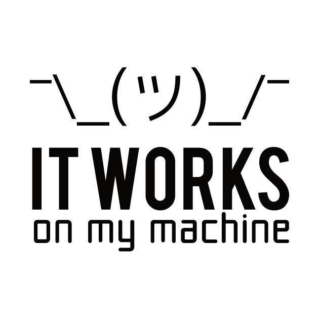

# Block Out Rouen Restaurant Menu Web Scraper

> :bulb: Web scraper for the Block Out Restaurant Menu. Works on my machine.

* Clone
* Install dependencies
* `cp credentials.txt.dist credentials.txt`
* Replace value inside `credentials.txt` with a correct channel on a Discord Server
* Run `service.sh`

> :bulb: You can set a CRON that will run `service.sh` everyday automagically.

